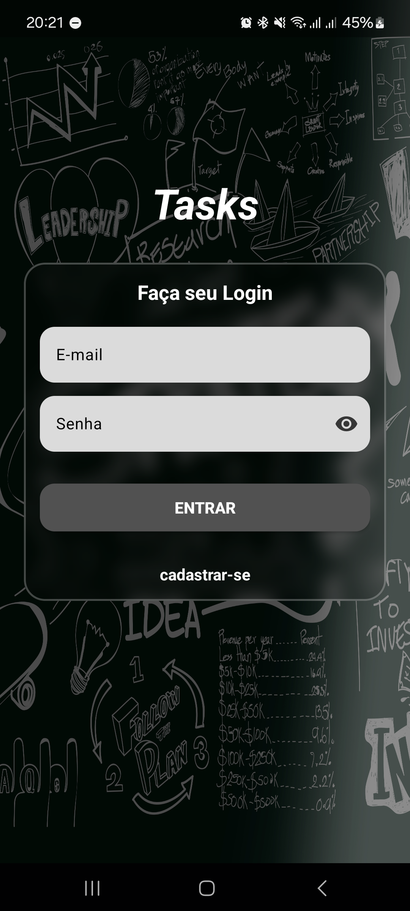
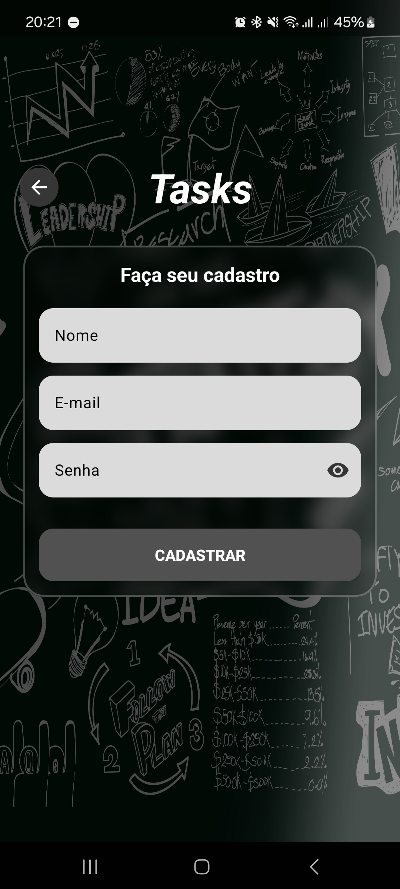

# Tasks

Um aplicativo de gerenciamento de tarefas para Android, desenvolvido em Kotlin com MVVM, ViewModel, LiveData, Hilt e Retrofit para comunicação com uma API REST.

---

## Funcionalidades:
- ✅ Autenticação de usuários (login e cadastro)
- ✅ Adicionar tarefas com data de conclusão
- ✅ Listagem de tarefas em diferentes filtros (Hoje, Amanhã, Semana, Mês)
- ✅ Concluir ou excluir tarefas
- ✅ Interface adaptada para diferentes temas

---

## Capturas de Tela

## Tecnologias e conhecimentos exercidos:
- **Linguagem:** Kotlin
- **Arquitetura:** MVVM (Model-View-ViewModel) + Clean Architecture
- **Coroutines**: Implementação de funções não sincronas.
- **Jetpack:** ViewModel & LiveData
- **Consumo de API:** Retrofit e OkHttp
- **Injeção de Dependência:** Hilt
- **Bibliotecas Adicionais:**
  - Dimezis|BlurView (Implementação blurview na tela de detalhes)
---

## Estrutura do Projeto

- **/data:** Camada de dados da aplicação, encontrando classes para acesso a dados (API) e repositórios.
- **/presentation:** Contém as telas e componentes da interface do usuário. Armazenando também as ViewModels
- **/di:** Configuração das dependências com Hilt.
- **/domain:** Classes para as regras de negócios da aplicação, como UseCases e Models e sealed classes.

---
